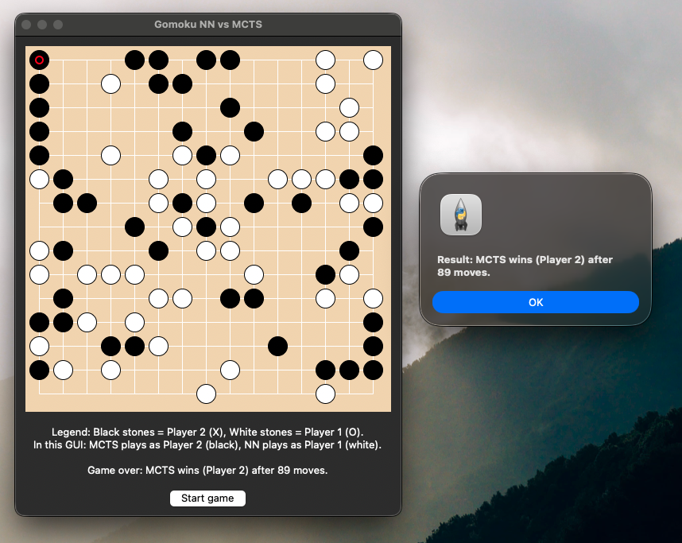

# Gomoku and Pente — AlphaZero-style NN + MCTS

This project implements a simplified AlphaZero-style pipeline for **Gomoku (15×15)** (and partially Pente):  
self-play data generation with MCTS, data cleaning and deduplication, CNN policy training, and a **GUI demo of NN vs MCTS**.

The code is structured to be easy to extend by other team members (e.g. swapping the network architecture, changing data sources, tuning MCTS, etc.).

> 💡 There is a working **Tkinter GUI** that shows a full NN vs MCTS game.  
> You can also run many games headless from the command line to gather statistics.

---

## Table of Contents

- [Environment & Requirements](#environment--requirements)
- [Data Pipeline](#data-pipeline)
  - [1. Generating raw self-play data](#1-generating-raw-self-play-data-datasetgenerator--generate_nightlypy)
  - [2. Cleaning & deduplicating data](#2-cleaning--deduplicating-data-data_cleaningpy)
- [Neural Network Models](#neural-network-models)
  - [Compact PolicyValueNet](#compact-policyvaluenet-2-channel-cnn)
  - [ResNetPolicyValueNet](#resnetpolicyvaluenet-legacy-1-channel-resnet)
- [Training the Policy Network](#training-the-policy-network)
  - [Training Command](#training-command-current-best-run)
  - [Training Results Summary](#training-results-summary)
- [Playing NN vs MCTS](#playing-nn-vs-mcts)
  - [GUI Mode](#gui-mode)
  - [CLI Mode](#cli-mode-no-gui)
- [How Things Fit Together](#how-things-fit-together)
- [Current Status & Next Steps](#current-status--possible-next-steps)
- [Authors](#authors)


---

## Environment & Requirements

**Python 3.10+** recommended.

**Dependencies:**
- PyTorch (CPU is sufficient; GPU optional but helpful)
- Tkinter (for GUI — usually bundled with Python)
- NumPy

Install dependencies:

```bash
pip install torch numpy
```

**Note:** This repo uses local modules (`CNN`, `board_logic_and_mcts`, `data`).  
Scripts like `train_policy.py` and `nn_vs_mcts.py` assume you run them from the project root.

---

## Data Pipeline

### 1. Generating raw self-play data (DatasetGenerator + generate_nightly.py)

Raw data is generated by MCTS self-play and written as CSV rows:

**Each row:**
```
b0..b224, cp, "(x,y)"
```

Where:
- `b0..b224` — flattened 15×15 board, integers (players/empty)
- `cp` — current player to move
- `"(x,y)"` — last move coordinates as a string tuple

**Core generator:** `data/DatasetGenerator.py`
- Uses `GBoard` and `Node` from `board_logic_and_mcts` to play MCTS vs MCTS games
- Writes one row per move into `data/raw/Gomoku_15x15.csv` (or another file if `FILENAME` is overridden)

**Nightly wrapper:** `data/generate_nightly.py`
- Repeatedly calls `DatasetGenerator.run(...)` for many games
- Writes to a single CSV

#### Example usages

From project root:

```bash
# 1) Simple run (e.g., 200 games, default settings)
python data/generate_nightly.py --games 200

# 2) Prevent MacOS from sleeping during long runs
caffeinate -i python data/generate_nightly.py --games 200

# 3) Two parallel processes (IMPORTANT: different output files)
caffeinate -i python data/generate_nightly.py \
    --games 200 \
    --output data/raw/runA.csv &

caffeinate -i python data/generate_nightly.py \
    --games 200 \
    --output data/raw/runB.csv &
```

**Key arguments:**
- `--games` — number of full games in this run
- `--starting_turn_min` / `--starting_turn_max` — randomize opening depth before MCTS takes over
- `--ending_turn` — stop games after given turn
- `--timeout` / `--sim_limit_x` / `--sim_limit_o` — MCTS compute budget per move
- `--output` — explicit CSV path (otherwise a timestamped file is created under `data/raw/`)

---

### 2. Cleaning & deduplicating data (data_cleaning.py)

Raw CSVs may contain:
- Invalid rows
- Illegal moves
- Duplicate (state, cp, move) pairs

**`data/data_cleaning.py`:**
- Reads one or many CSVs (glob patterns supported)
- Parses rows in two formats:
  - `b0..b224, cp, "(x,y)"`
  - `b0..b224, cp, move_x, move_y`
- Discards:
  - Rows with wrong length (`bad_len`)
  - Parsing errors (`bad_parse`)
  - Moves out of board (`bad_vals`)
- Deduplicates exact (board, cp, move) combinations
- Writes a single cleaned CSV (no header) — by default `data/all_combined_clean_new.csv`

#### Example usage

```bash
# Default: clean raw/all_combined_new.csv → all_combined_clean_new.csv
python data/data_cleaning.py

# Clean all CSVs under data/raw/ and merge them
python data/data_cleaning.py --inputs "data/raw/*.csv" --output data/all_combined_clean_new.csv
```

The cleaned file is then used as input for the training script.

---

## Neural Network Models

### Compact PolicyValueNet (2-channel CNN)

**Defined in:** `CNN/nn_model.py`

**Input:** `(B, 2, N, N)`
- Channel 0: current player stones
- Channel 1: opponent stones

**Architecture:**
- **Trunk:** small Conv–BN–ReLU stack
- **Policy head:**
  - Conv → BN → ReLU → Flatten → Dropout → Linear → logits over N×N actions
- **Value head:**
  - Conv → BN → ReLU → Flatten → Linear → ReLU → Dropout → Linear → tanh → scalar in [-1, 1]

**Useful for:**
- Training from cleaned CSV (`PolicyDataset`)
- Experiments with compact models

---

### ResNetPolicyValueNet (legacy 1-channel ResNet)

**Defined in:** `CNN/resnet_model.py`

**Input:** `(B, 1, N, N)` with values in {-1, 0, +1}
- `+1` — current player stones
- `-1` — opponent stones
- `0` — empty

**Architecture:**
- Basic residual trunk with configurable number of residual blocks
- Policy and value heads similar to PolicyValueNet

**Used primarily in:**
- `CNN/nn_vs_mcts.py` for the NN vs MCTS demo
- Compatible with weights saved in `CNN/alphazero_policy_v_best.pth` (assuming the same architecture was used in training)

---

## Training the Policy Network

**Training script:** `CNN/train_policy.py`

**Features:**
- Loads `PolicyDataset` from a cleaned CSV
- Splits into train/val (85% / 15%) with a fixed random seed
- Uses:
  - **Optimizer:** AdamW (lr=1e-3, weight_decay=5e-4 by default)
  - **Scheduler:** ReduceLROnPlateau (LR decay on val loss plateau)
  - **Early stopping** with best-model restore
- **Loss:**
  - **Policy:** CrossEntropyLoss over N×N actions
  - **Value (optional):** MSELoss (if value labels are present in CSV; can be weighted by `--value-weight`)

---

### Training Command (current best run)

Latest run (on CPU) was launched with:

```bash
python CNN/train_policy.py \
    --csv data/all_combined_clean_new.csv \
    --board-n 15 \
    --epochs 50 \
    --patience 10 \
    --batch-size 256 \
    --augment \
    --model-out CNN/alphazero_policy_v_best.pth
```

**Key points:**
- Board size: N = 15
- Dataset: `data/all_combined_clean_new.csv`
- Batch size: 256
- Augmentation: ON (`--augment`), using full D4 symmetries (8 transforms)
- Device: CPU (PyTorch automatically chose CPU)

---

### Training Results Summary

**Log highlights:**

**Dataset:**
- 15,478 samples loaded
- Split into Train: 13,157, Val: 2,321
- Augmentation: ON

**Training:**
- Optimizer: AdamW lr=1e-3 weight_decay=5e-4
- Scheduler: ReduceLROnPlateau with decay by 10× on plateau
- Early stopping triggered after lack of improvement for 10 epochs

**Performance** (policy loss only, value_weight=0):
- Initial val loss ≈ 5.40
- Rapid improvement in the first epochs
- **Best validation loss:**
  - `val_loss = 4.0713` at epoch 40
- After epoch 50:

```
[STOP] Early stopping. Best epoch=40, best val_loss=4.0713
[READY] Best model loaded from: CNN/alphazero_policy_v_best.pth
```

**This means:**
- The best model from epoch 40 is saved in: `CNN/alphazero_policy_v_best.pth`
- This file is then used by `nn_vs_mcts.py` for NN vs MCTS games

---

## Playing NN vs MCTS

The NN vs MCTS script lives in: `CNN/nn_vs_mcts.py`

**It:**
- Loads the trained policy-value network (`alphazero_policy_v_best.pth`)
- Uses `GBoard` and MCTS from `board_logic_and_mcts`
- Allows:
  - GUI play (Tkinter)
  - CLI play for many games + statistics

---

### GUI Mode

Run from project root:

```bash
python CNN/nn_vs_mcts.py
```

**Opens a Tkinter window** with a 15×15 Gomoku board.

**Stones are drawn as:**
- **Black** = Player 2 (X)
- **White** = Player 1 (O)

**Legend explains** which player is NN and which is MCTS (by default in the GUI:
- MCTS plays as Player 2 (black)
- NN plays as Player 1 (white))

**The GUI displays:**
- The current player to move
- The final winner (NN or MCTS)
- Plays out a full game autonomously



---

### CLI Mode (no GUI)

Any time you pass arguments to `nn_vs_mcts.py`, it switches to CLI mode.

From project root:

```bash
# 10 games, NN as Player 2 (black, starts), MCTS as Player 1 (white)
python CNN/nn_vs_mcts.py --games 10 --mcts-sims 2000

# 10 games, MCTS as Player 2 (black, starts), NN as Player 1 (white)
python CNN/nn_vs_mcts.py --games 10 --mcts-sims 2000 --mcts-as-p2
```

**Parameters:**
- `--games` — number of games to play
- `--mcts-sims` — number of MCTS simulations per move:
  - Larger = stronger but slower MCTS
  - Smaller = weaker but faster
- `--mcts-as-p2` — if set, MCTS plays as Player 2 (black, starts); otherwise NN starts as Player 2

**At the end you get statistics such as:**
- How many wins NN vs MCTS
- Draws
- Approximate NN win rate in percent
- Breakdown by Player 1 / Player 2

---

## How Things Fit Together

**High-level pipeline:**

### 1. Data generation
- `DatasetGenerator.run(...)` (MCTS vs MCTS) produces raw board states + moves
- `data/generate_nightly.py` runs this in loops overnight, writing CSVs into `data/raw/`

### 2. Data cleaning
- `data/data_cleaning.py` merges raw files, filters invalid rows, and deduplicates exact state+move rows
- Outputs `data/all_combined_clean_new.csv`

### 3. Training
- `CNN/dataset_policy.py`: `PolicyDataset` converts each row into:
  - `(2, N, N)` input tensor (current player plane + opponent plane)
  - Policy target index `x * N + y` (move location)
  - Optionally, a scalar value
- `CNN/nn_model.py`: `PolicyValueNet` maps `(2, N, N)` → policy logits (N×N) + value
- `CNN/train_policy.py` trains the model with augmentation, LR scheduling and early stopping
- Best model weights are saved to: `CNN/alphazero_policy_v_best.pth`

### 4. Evaluation / Demo
- `CNN/nn_vs_mcts.py` loads the best model and plays NN vs MCTS:
  - GUI mode for visual demo
  - CLI mode for many games and statistics

---

## Current Status & Possible Next Steps

### Current status

✅ **End-to-end pipeline works:**
- Self-play data → cleaned dataset → CNN training → NN vs MCTS demo

✅ **Latest training run** (with augmentation) reached:
- `val_loss ≈ 4.07` on a dataset of 15k+ samples

✅ **GUI and CLI** for NN vs MCTS are functional and parameterized

✅ **Code is structured and commented** so that another team member can:
- Swap architectures
- Tweak training hyperparameters
- Extend to Pente more fully

### Potential next steps

- **Improve model architecture** (deeper ResNet, wider channels)
- **Integrate value head training** using game outcomes
- **Implement true AlphaZero loop** (NN guides MCTS during self-play)
- **Add tests and benchmarks** for:
  - NN vs pure MCTS at various simulation counts
  - Impact of data volume and augmentation on performance
- **Extend board logic and datasets for Pente**

---

## Authors


---
